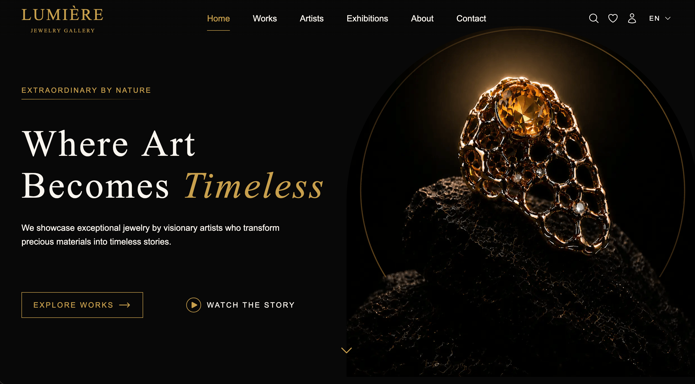
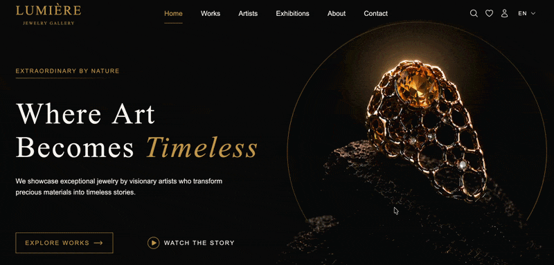
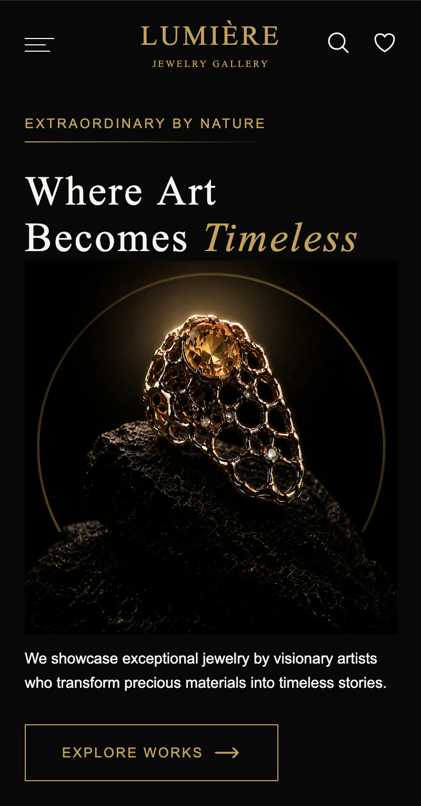

# jewelry-LUMIÈRE

以 Vue 3 + TypeScript 打造的珠寶藝廊網站，提供作品瀏覽、模糊搜尋與收藏功能，並支援桌機與手機版。

Demo：https://allen9478.github.io/jewelry-LUMIRE/


## 畫面預覽







## 使用技術

Vue 3、TypeScript、Vite、Tailwind CSS、Vue Router、Pinia、Firebase、Fuse.js、ESLint

## 技術重點

- Pinia 狀態職責拆分
- 從 JavaScript 逐步遷移至 TypeScript
- 使用 Fuse.js 實作模糊搜尋

## 遇到的問題與解決

- 狀態邏輯分散在各頁面，沒有統一管理，導致單頁程式碼過長 → 建立 composables 管理 Pinia 狀態邏輯
- 一開始直接在 main 修改程式碼，沒有使用分支與 PR 流程 → 養成用 `git switch -c` 建立新分支的習慣

## 本地執行

```bash
git clone https://github.com/Allen9478/jewelry-LUMIRE.git
cd jewelry-LUMIRE
npm install
```

### Firebase 設定

本專案使用 Firebase，需先在 [Firebase Console](https://console.firebase.google.com/) 建立自己的專案，並啟用 Authentication 與 Firestore。

複製範例檔，並填入自己的 Firebase 設定：

```bash
cp .env.example .env
```

`.env` 需要的變數：

```env
VITE_FIREBASE_API_KEY=
VITE_FIREBASE_AUTH_DOMAIN=
VITE_FIREBASE_PROJECT_ID=
VITE_FIREBASE_STORAGE_BUCKET=
VITE_FIREBASE_MESSAGING_SENDER_ID=
VITE_FIREBASE_APP_ID=
```

### 啟動

```bash
npm run dev
```
